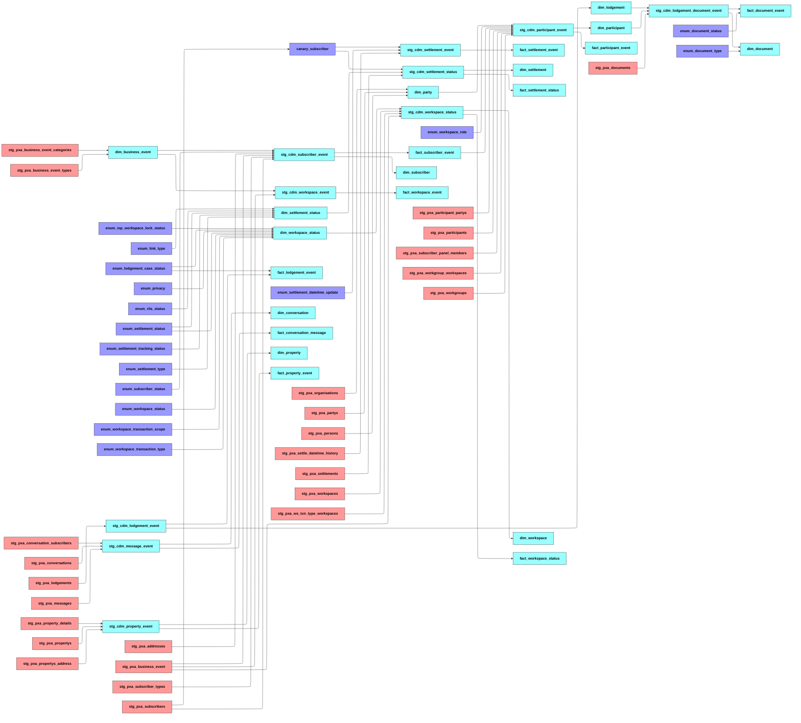

# Data Flow

```mermaid
%%{init: { "flowchart": { "defaultRenderer": "elk"} } }%%
graph LR
    canary_subscriber --> stg_cdm_settlement_event
    canary_subscriber --> stg_cdm_settlement_status
    dim_business_event --> stg_cdm_subscriber_event
    dim_business_event --> stg_cdm_workspace_event
    dim_lodgement --> stg_cdm_lodgement_document_event
    dim_participant --> stg_cdm_lodgement_document_event
    dim_party --> stg_cdm_participant_event
    dim_settlement_status --> stg_cdm_settlement_status
    dim_workspace_status --> stg_cdm_workspace_status
    enum_document_status --> fact_document_event
    enum_document_type --> dim_document
    enum_iop_workspace_lock_status --> dim_workspace_status
    enum_link_type --> dim_settlement_status
    enum_lodgement_case_status --> dim_workspace_status
    enum_lodgement_case_status --> fact_lodgement_event
    enum_privacy --> dim_workspace_status
    enum_rits_status --> dim_settlement_status
    enum_settlement_datetime_update --> stg_cdm_settlement_event
    enum_settlement_status --> dim_settlement_status
    enum_settlement_status --> dim_workspace_status
    enum_settlement_tracking_status --> dim_settlement_status
    enum_settlement_type --> dim_settlement_status
    enum_subscriber_status --> stg_cdm_subscriber_event
    enum_workspace_role --> stg_cdm_participant_event
    enum_workspace_status --> dim_workspace_status
    enum_workspace_transaction_scope --> dim_workspace_status
    enum_workspace_transaction_type --> dim_workspace_status
    fact_subscriber_event --> stg_cdm_participant_event
    stg_cdm_lodgement_document_event --> dim_document
    stg_cdm_lodgement_document_event --> fact_document_event
    stg_cdm_lodgement_event --> dim_lodgement
    stg_cdm_lodgement_event --> fact_lodgement_event
    stg_cdm_message_event --> dim_conversation
    stg_cdm_message_event --> fact_conversation_message
    stg_cdm_participant_event --> dim_participant
    stg_cdm_participant_event --> fact_participant_event
    stg_cdm_property_event --> dim_property
    stg_cdm_property_event --> fact_property_event
    stg_cdm_settlement_event --> fact_settlement_event
    stg_cdm_settlement_status --> dim_settlement
    stg_cdm_settlement_status --> fact_settlement_status
    stg_cdm_subscriber_event --> dim_subscriber
    stg_cdm_subscriber_event --> fact_subscriber_event
    stg_cdm_workspace_event --> fact_workspace_event
    stg_cdm_workspace_status --> dim_workspace
    stg_cdm_workspace_status --> fact_workspace_status
    stg_pxa_addresses --> stg_cdm_subscriber_event
    stg_pxa_business_event --> stg_cdm_subscriber_event
    stg_pxa_business_event --> stg_cdm_workspace_event
    stg_pxa_business_event --> stg_cdm_workspace_status
    stg_pxa_business_event_categories --> dim_business_event
    stg_pxa_business_event_types --> dim_business_event
    stg_pxa_conversation_subscribers --> stg_cdm_message_event
    stg_pxa_conversations --> stg_cdm_message_event
    stg_pxa_documents --> stg_cdm_lodgement_document_event
    stg_pxa_lodgements --> stg_cdm_lodgement_event
    stg_pxa_messages --> stg_cdm_message_event
    stg_pxa_organisations --> dim_party
    stg_pxa_participant_partys --> stg_cdm_participant_event
    stg_pxa_participants --> stg_cdm_participant_event
    stg_pxa_partys --> dim_party
    stg_pxa_persons --> dim_party
    stg_pxa_property_details --> stg_cdm_property_event
    stg_pxa_propertys --> stg_cdm_property_event
    stg_pxa_propertys_address --> stg_cdm_property_event
    stg_pxa_settle_datetime_history --> stg_cdm_settlement_event
    stg_pxa_settlements --> stg_cdm_settlement_status
    stg_pxa_subscriber_panel_members --> stg_cdm_participant_event
    stg_pxa_subscriber_types --> stg_cdm_subscriber_event
    stg_pxa_subscribers --> canary_subscriber
    stg_pxa_subscribers --> stg_cdm_subscriber_event
    stg_pxa_workgroup_workspaces --> stg_cdm_participant_event
    stg_pxa_workgroups --> stg_cdm_participant_event
    stg_pxa_workspaces --> stg_cdm_workspace_status
    stg_pxa_ws_txn_type_workspaces --> stg_cdm_workspace_status

classDef source    fill:#f99,stroke:#333,stroke-width:1px,font-weight:bold,color:#000;
classDef ephemeral fill:#99f,stroke:#333,stroke-width:1px,font-weight:bold,color:#000;
classDef ref       fill:#9ff,stroke:#333,stroke-width:1px,font-weight:bold,color:#000;

class stg_pxa_addresses,stg_pxa_business_event,stg_pxa_business_event_categories,stg_pxa_business_event_types source
class stg_pxa_conversation_subscribers,stg_pxa_conversations,stg_pxa_documents,stg_pxa_lodgements,stg_pxa_messages source
class stg_pxa_organisations,stg_pxa_participant_partys,stg_pxa_participants,stg_pxa_partys,stg_pxa_persons source
class stg_pxa_property_details,stg_pxa_propertys,stg_pxa_propertys_address,stg_pxa_settle_datetime_history source
class stg_pxa_settlements,stg_pxa_subscriber_panel_members,stg_pxa_subscriber_types,stg_pxa_subscribers source
class stg_pxa_workgroup_workspaces,stg_pxa_workgroups,stg_pxa_workspaces,stg_pxa_ws_txn_type_workspaces source

class canary_subscriber,enum_document_status,enum_document_type,enum_iop_workspace_lock_status,enum_link_type ephemeral
class enum_lodgement_case_status,enum_privacy,enum_rits_status,enum_settlement_datetime_update,enum_settlement_status ephemeral
class enum_settlement_tracking_status,enum_settlement_type,enum_subscriber_status,enum_workspace_role ephemeral
class enum_workspace_status,enum_workspace_transaction_scope,enum_workspace_transaction_type ephemeral

class dim_business_event,dim_conversation,dim_document,dim_lodgement,dim_participant,dim_party,dim_property ref
class dim_settlement,dim_settlement_status,dim_subscriber,dim_workspace,dim_workspace_status,fact_conversation_message ref
class fact_document_event,fact_lodgement_event,fact_participant_event,fact_property_event,fact_settlement_event ref
class fact_settlement_status,fact_subscriber_event,fact_workspace_event,fact_workspace_status,stg_cdm_lodgement_document_event ref
class stg_cdm_lodgement_event,stg_cdm_message_event,stg_cdm_participant_event,stg_cdm_property_event,stg_cdm_settlement_event ref
class stg_cdm_settlement_status,stg_cdm_subscriber_event,stg_cdm_workspace_event,stg_cdm_workspace_status ref
```